<div align="center">

# 🧠 SPARC — Smart Perception Assistive Reality Companion

### *AI-Powered Wearable System for Real-Time Sign Language Communication & Navigation*

<br>

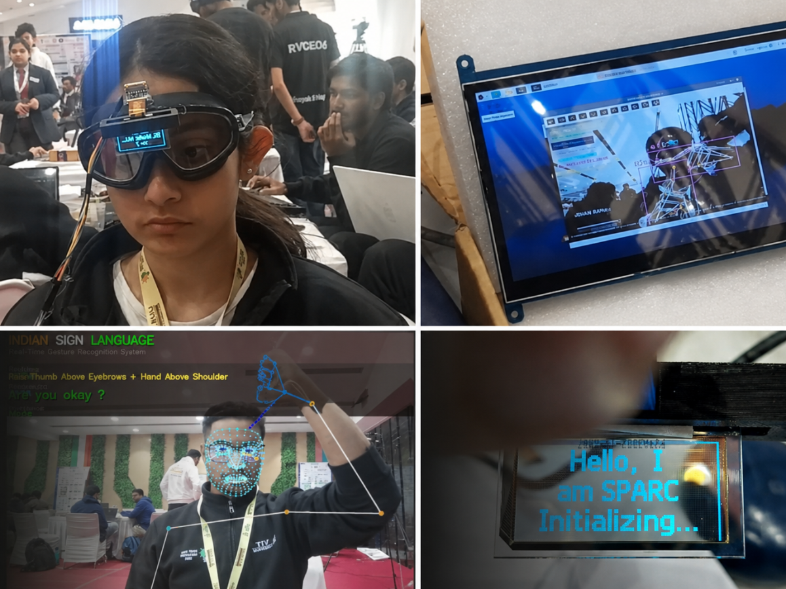

<br><br>

[](https://python.org)
[](https://tensorflow.org)
[](https://opencv.org)
[](https://raspberrypi.org)
[](LICENSE)
[](#-contributing)

<br>

**An AI-powered wearable assistive system that enables real-time two-way sign language communication, environmental awareness, and emergency safety assistance. By combining computer vision, edge AI, and smart sensors, it helps Deaf and speech-impaired individuals communicate, navigate, and interact more independently in everyday life.**

[🚀 Quick Start](#-quick-start) · [📖 How It Works](#-how-it-works) · [🏗️ Architecture](#%EF%B8%8F-system-architecture) · [🔧 Hardware](#-hardware-components) · [📸 Gallery](#-project-gallery) · [🗺️ Roadmap](#%EF%B8%8F-roadmap)

</div>

---

## 📌 Table of Contents

- [Highlights](#-highlights)
- [Why SPARC?](#-why-sparc)
- [Key Features](#-key-features)
- [Project Gallery](#-project-gallery)
- [System Architecture](#%EF%B8%8F-system-architecture)
- [How It Works](#-how-it-works)
- [Hardware Components](#-hardware-components)
- [Software Stack](#-software-stack)
- [Repository Structure](#-repository-structure)
- [Quick Start](#-quick-start)
- [Usage Guide](#-usage-guide)
- [Model Details](#-model-details)
- [Configuration](#%EF%B8%8F-configuration)
- [Troubleshooting](#-troubleshooting)
- [Roadmap](#%EF%B8%8F-roadmap)
- [Contributing](#-contributing)
- [License](#-license)

---

## ✨ Highlights

<table>
<tr>
<td width="50%">

🎯 **Real-Time Sign Recognition** — ISL & ASL support with <200ms latency

🧠 **Edge AI Processing** — Fully offline, no cloud dependency

👓 **Wearable Form Factor** — Spectacle-mounted for hands-free use

🔊 **Gesture-to-Speech** — Converts signs to spoken words via TTS

📟 **OLED Visual Feedback** — Compact wearable display output

😊 **Emotion Detection** — CNN-based facial expression analysis

</td>
<td width="50%">

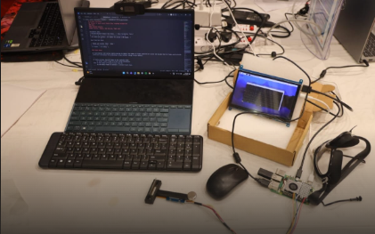

</td>
</tr>
</table>

---

## 💡 Why SPARC?

<div align="center">


&nbsp;&nbsp;
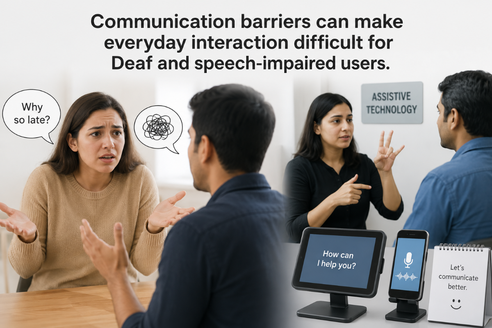

</div>

<br>

In many daily situations — schools, hospitals, workplaces, and public spaces — Deaf and speech-impaired individuals face communication barriers without an interpreter nearby. Existing solutions fall short:

| ❌ Current Problem | ✅ How SPARC Solves It |
|---|---|
| One-way translation tools don't support natural conversation | Two-way communication with gesture-to-speech and speech-to-text |
| Bulky glove-based systems are uncomfortable and impractical | Lightweight spectacle-mounted wearable form factor |
| Cloud-dependent apps create latency and privacy issues | Fully offline edge AI processing on Raspberry Pi |
| Most solutions don't support a wearable, everyday form factor | Designed as an always-ready communication companion |
| Safety and situational awareness are missing entirely | Integrated object detection and environmental awareness |

> **SPARC is not just a sign language translator — it's a complete assistive reality companion that sits on the user, reads gestures, speaks responses, and gives compact visual feedback.**

---

## 🚀 Key Features

<table>
<tr>
<td align="center" width="33%">
<h3>🤟 Sign Language</h3>
<p>Real-time ISL & ASL recognition using hand landmark detection and ML classifiers</p>
</td>
<td align="center" width="33%">
<h3>😊 Emotion Detection</h3>
<p>CNN-based facial expression analysis (Happy, Sad, Angry, Neutral)</p>
</td>
<td align="center" width="33%">
<h3>🔊 Text-to-Speech</h3>
<p>Automatic audio synthesis of recognized gestures via Google TTS</p>
</td>
</tr>
<tr>
<td align="center" width="33%">
<h3>📟 OLED Display</h3>
<p>Wearable visual feedback on a compact 128×64 SPI display</p>
</td>
<td align="center" width="33%">
<h3>🎯 Object Detection</h3>
<p>YOLOv8-powered scene awareness for navigation assistance</p>
</td>
<td align="center" width="33%">
<h3>📡 Offline-First</h3>
<p>Complete edge processing — no internet required for core operation</p>
</td>
</tr>
</table>

### Supported Recognition Modes

| Mode | Language | Input | Output | Model Format |
|:---|:---|:---|:---|:---|
| 🔤 Characters (A–Z) | ASL | Hand Landmarks | Text / TTS | `.pkl` |
| 🔢 Numbers (1–9) | ASL | Hand Landmarks | Text / TTS | `.pkl` |
| 💬 Words | ASL | Hand Landmarks | Text / TTS | `.pkl` |
| 🔤 Characters | ISL | Hand Landmarks | Text / TTS | `.h5` |
| 🔢 Numbers | ISL | Hand Landmarks | Text / TTS | `.h5` |
| 😊 Emotions | Universal | Facial Image | Text / UI | `.h5` |

---

## 📸 Project Gallery

<div align="center">

### 👓 Wearable Prototype

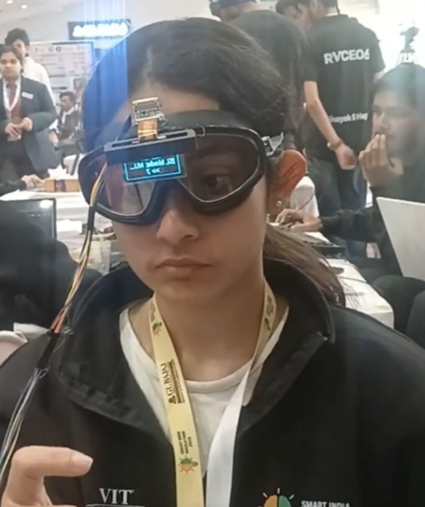

*User wearing the spectacle-mounted fitment prototype*

<br>

### 🛠️ Hardware & Development

<table>
<tr>
<td align="center">
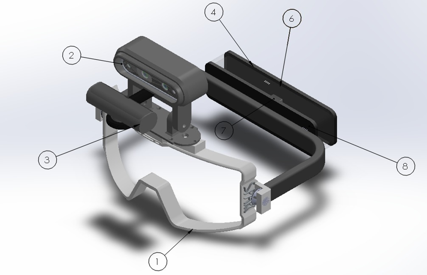
<br><em>Wearable fitment design — front view</em>
</td>
<td align="center">
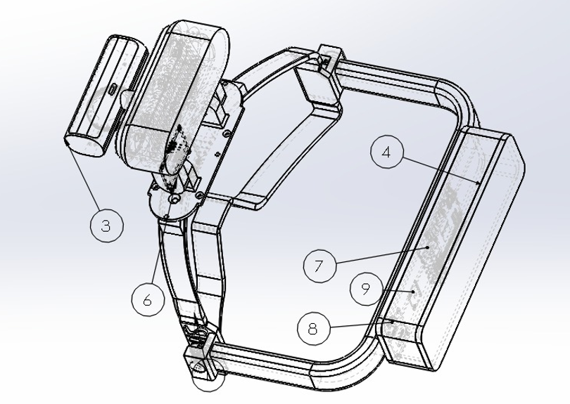
<br><em>Component integration and wiring</em>
</td>
</tr>
</table>

<br>

### 🖥️ Live Recognition in Action

<table>
<tr>
<td align="center">
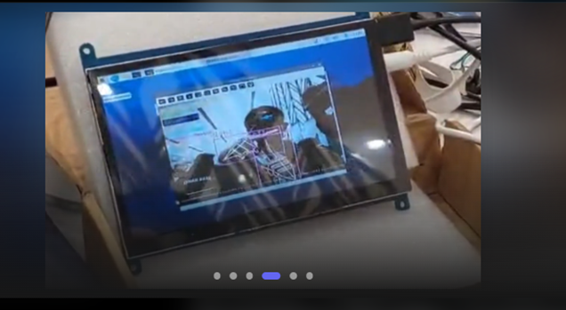
<br><em>Live gesture recognition during testing</em>
</td>
<td align="center">
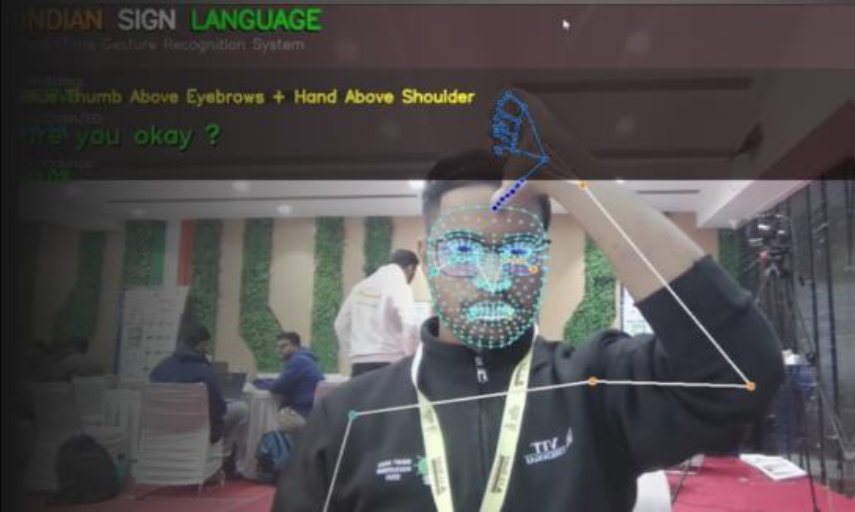
<br><em>Hand landmark recognition view</em>
</td>
</tr>
<tr>
<td align="center">
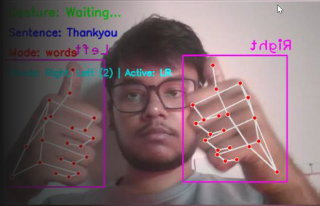
<br><em>Landmark-based recognition interface</em>
</td>
<td align="center">
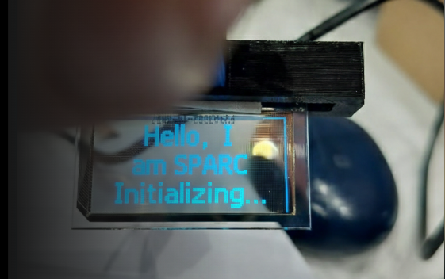
<br><em>Wearable OLED displaying system output</em>
</td>
</tr>
</table>

<br>

### 📐 CAD & Design

<table>
<tr>
<td align="center" width="40%">
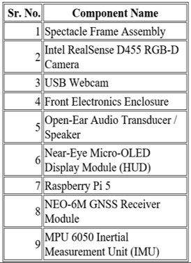
<br><em>SPARC CAD diagram</em>
</td>
<td align="center" width="60%">
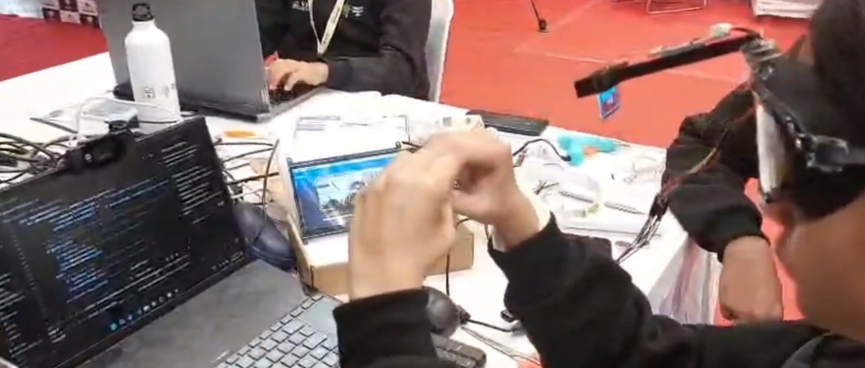
<br><em>Development table during hardware integration</em>
</td>
</tr>
</table>

</div>

---

## 🏗️ System Architecture

<div align="center">

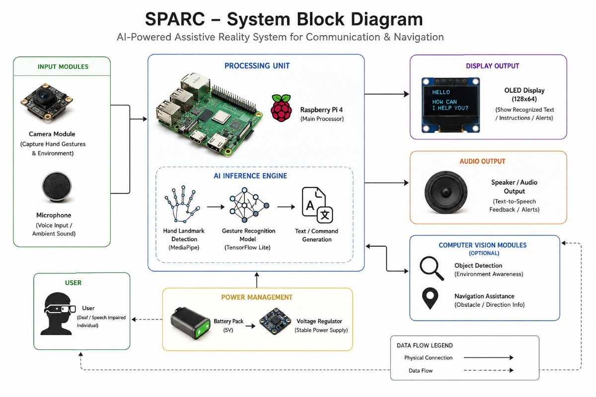

*High-level architecture of the wearable assistive communication platform*

</div>

<br>

At a high level, the workflow is simple: the camera captures the user's gesture → software extracts landmarks and classifies the sign → result is converted into sentence-level output → OLED/audio services present it to the user and listener.

```
┌──────────────────────────────────────────────────────────────────┐
│                        🔧 HARDWARE LAYER                        │
│   📷 Camera      📟 OLED Display      🎤 Mic       🔊 Speaker   │
└───────┬──────────────┬─────────────────┬────────────┬───────────┘
        │              │                 │            │
        ▼              ▼                 ▼            ▼
┌──────────────────────────────────────────────────────────────────┐
│                     🧠 PROCESSING LAYER                         │
│                                                                  │
│   ┌──────────────┐ ┌──────────────┐ ┌───────────┐ ┌───────────┐│
│   │   Gesture     │ │   Emotion    │ │   Voice   │ │    TTS    ││
│   │  Recognizer   │ │  Detector    │ │   Input   │ │  Engine   ││
│   └──────┬───────┘ └──────┬───────┘ └─────┬─────┘ └─────┬─────┘│
│          │                │               │             │       │
│          ▼                ▼               ▼             ▼       │
│   ┌─────────────────────────────────────────────────────────┐   │
│   │           📊 Sentence Builder & Output Router           │   │
│   └─────────────────────────────────────────────────────────┘   │
└──────────────────────────────────────────────────────────────────┘
        │                                           │
        ▼                                           ▼
┌──────────────────────────────────────────────────────────────────┐
│              ⚙️ Configuration & Logging Backbone                │
└──────────────────────────────────────────────────────────────────┘
```

### End-to-End Workflow

<div align="center">

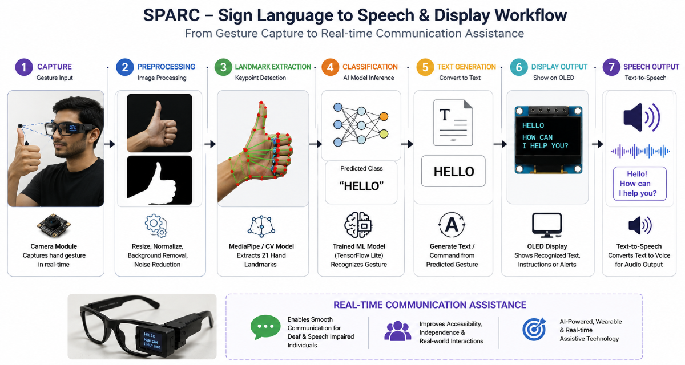

*End-to-end gesture-to-speech and gesture-to-text workflow*

</div>

### Software Architecture

<div align="center">

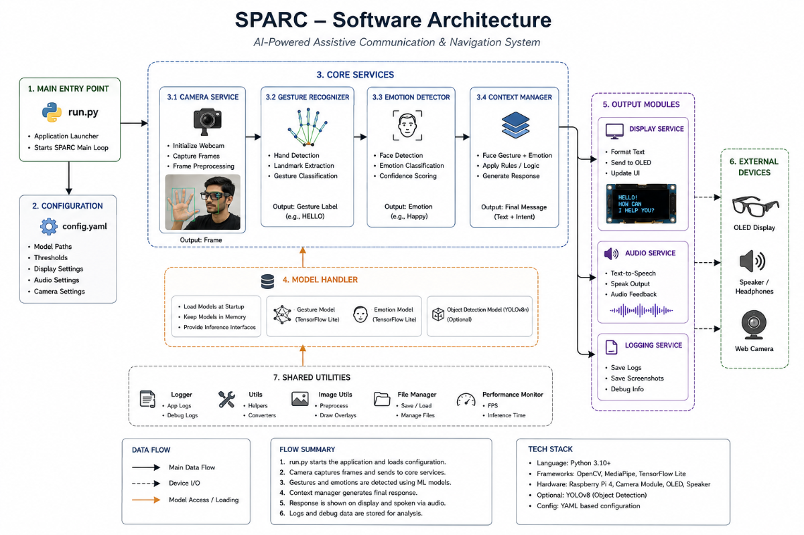

*Software architecture and module interactions inside the SPARC repository*

</div>

---

## ⚙️ How It Works

```
👤 User Signs  →  📷 Camera Captures  →  ✋ Hand Landmarks Extracted
                                                    │
                                                    ▼
                                          🧠 ML Model Classifies
                                                    │
                                                    ▼
                              📝 Sentence Builder  ←─┘
                                        │
                          ┌─────────────┼─────────────┐
                          ▼                           ▼
                   📟 OLED Display              🔊 TTS Output
                   (Visual Feedback)           (Audio Feedback)
```

**Step-by-step:**

1. **Capture** — The wearable camera streams live frames to the recognition pipeline
2. **Extract** — Hand landmarks and optional face/pose cues are extracted using MediaPipe
3. **Classify** — The ML model classifies the sign or gesture with confidence scoring
4. **Build** — Results are accumulated into a readable word or sentence
5. **Display** — The OLED shows recognized text in real-time
6. **Speak** — The audio service speaks the completed sentence aloud
7. **Repeat** — The user continues conversation without switching devices

---

## 🔧 Hardware Components

<div align="center">

| # | Component | Role |
|:---:|:---|:---|
| 1 | **Raspberry Pi 4** | Main local compute platform for inference & orchestration |
| 2 | **USB Camera** | Captures hand and body gestures from wearable viewpoint |
| 3 | **Waveshare OLED Display** | Presents compact captions and system feedback |
| 4 | **Microphone Module** | Optional speech input path for voice-based interaction |
| 5 | **Bluetooth Speaker** | Converts text to speech for external listeners |
| 6 | **Li-ion / Li-Po Battery** | Portable power for the wearable prototype |
| 7 | **Spectacle Frame** | Mechanical mounting platform for the assistive unit |
| 8 | **Optional IMU Module** | Future motion/safety extension support |

</div>

<br>

> **Required:** Raspberry Pi 4+ (or equivalent SBC) • USB webcam • Speakers  
> **Optional:** Waveshare 1.51" OLED (128×64, SPI) • Bluetooth/USB microphone • Intel RealSense depth camera  
> 
> *SPARC operates fully without optional components through graceful hardware fallback.*

---

## 💻 Software Stack

| Library | Role | Category |
|:---|:---|:---|
| `opencv-python` | Computer vision & image acquisition | 📷 Vision |
| `cvzone` / `MediaPipe` | Hand tracking & facial landmark extraction | ✋ Tracking |
| `tensorflow` / `Keras` | Deep learning model inference (ISL, Emotion) | 🧠 ML |
| `scikit-learn` / `joblib` | Machine learning model inference (ASL) | 🧠 ML |
| `ultralytics` | YOLOv8 object detection | 🎯 Detection |
| `gTTS` | Text-to-speech generation | 🔊 Audio |
| `pygame` | Audio file playback | 🔊 Audio |
| `SpeechRecognition` / `pyaudio` | Voice input processing | 🎤 Input |
| `Pillow` | Image manipulation for OLED output | 📟 Display |
| `pyrealsense2` | RealSense camera support (optional) | 📷 Vision |

---

## 📁 Repository Structure

```
SPARC-Smart-Perception-Assistive-Reality-Companion/
│
├── 🚀 run.py                          # Application entry point
├── 📋 requirements.txt                # Python dependencies
├── 📄 README.md                       # This file
│
├── 🧠 SPARC/                          # Core application package
│   ├── main.py                        # Interactive runtime orchestrator
│   ├── core/                          # Model loading & prediction wrapper
│   │   └── model_handler.py
│   ├── services/                      # Output services
│   │   ├── display.py                 # OLED wrapper (rotation, scaling, fallback)
│   │   ├── audio.py                   # TTS playback with graceful cleanup
│   │   └── logger.py                  # Timestamped logging
│   ├── gestures/                      # Gesture recognition pipeline
│   │   └── gesture_recognizer.py      # Hand detection, sentence building, output
│   ├── emotions/                      # Emotion detection module
│   │   └── emotion_detector.py        # CNN + Haar cascade face classification
│   ├── vision/                        # Object detection layer
│   │   └── object_detection.py        # YOLOv8 scene/object awareness
│   ├── cameras/                       # Camera abstraction
│   │   └── realsense_manager.py       # RealSense ↔ USB fallback
│   ├── config/                        # Configuration management
│   │   ├── settings.py                # Central constants
│   │   └── config_io.py              # Persisted display/audio calibration
│   ├── isl_recognition/              # ISL-specific gesture pipeline
│   └── utils/                         # Geometry helpers
│       └── geometry.py                # Landmark distance & angle calcs
│
├── 😊 Face_Recognition/              # Standalone emotion detection module
│   ├── src/
│   │   ├── emotions.py                # CNN architecture & training
│   │   ├── dataset_prepare.py         # FER-2013 CSV → image folders
│   │   └── haarcascade_frontalface_default.xml
│   ├── model.h5                       # Saved emotion classifier
│   └── imgs/accuracy.png             # Training performance visualization
│
├── 🔤 Indian-Sign-Language-Detection/ # ISL model assets
│
├── 📚 lib/                            # Hardware drivers
│   └── waveshare_OLED/               # Waveshare OLED display drivers
│
├── 🛠️ scripts/                       # Utility & calibration scripts
│   ├── calibrate_display*.py          # OLED calibration tools
│   ├── voice_input.py                 # Voice input testing
│   ├── depth.py / realsense.py        # Depth camera utilities
│   └── fall.py / fall_detector1.py    # Fall detection experiments
│
├── 🧪 X/                             # Development & testing workshop
│   ├── test_*.py                      # Camera & detection diagnostics
│   ├── *.md                           # Troubleshooting documentation
│   └── backup.py / main_simple.py     # Fallback runtime versions
│
├── 📊 Trained Models
│   ├── RFC_MODEL_2_0_9_modes.pkl      # ASL number classifier
│   ├── RFC_MODEL_3_A_Z_modes.pkl      # ASL character classifier
│   ├── yolov8n.pt                     # YOLOv8 object detection weights
│   └── weights/                       # Additional model weights
│
└── 📸 docs/images/                    # Documentation images
```

---

## 🚀 Quick Start

### Prerequisites

- Python 3.9+
- USB webcam
- Speakers/headphones
- Raspberry Pi 4 (recommended) or any Linux/macOS/Windows machine

### Installation

```bash
# 1. Clone the repository
git clone https://github.com/Hazz-Y/SPARC-Smart-Perception-Assistive-Reality-Companion.git
cd SPARC-Smart-Perception-Assistive-Reality-Companion

# 2. Create a virtual environment
python -m venv venv
source venv/bin/activate        # Linux/macOS
# venv\Scripts\activate          # Windows

# 3. Install system dependencies (Linux/Raspberry Pi)
sudo apt-get update
sudo apt-get install -y mpg123 libportaudio2 python3-pip python3-venv

# 4. Install Python dependencies
pip install -r requirements.txt

# 5. Launch SPARC
python run.py
```

### Execution Pipeline

```
python run.py
    → imports SPARC.main
    → initializes logging
    → initializes OLED display service
    → initializes audio service
    → selects language mode (ISL or ASL)
    → launches GestureRecognizer
    → enters live recognition loop
    → speaks and displays recognized output
    → cleans up on exit
```

---

## 🎮 Usage Guide

### Interactive Controls

| Key | Action |
|:---:|:---|
| `1` / `ISL` | Select Indian Sign Language mode |
| `2` / `ASL` | Select American Sign Language mode |
| `g` / `gesture` | Enter gesture recognition mode |
| `n` / `number` | Switch to number mode |
| `c` / `character` | Switch to character mode |
| `w` / `word` | Switch to word mode |
| `q` / `quit` | Exit SPARC |

### How to Use

1. **Start the system** — Run `python run.py` and select your language mode
2. **Position yourself** — Ensure the camera frames your upper body and hands clearly
3. **Sign naturally** — Recognized gestures accumulate to build sentences
4. **Corrections** — Use the backspace gesture to remove the last character
5. **Completion** — Use the completion gesture to finalize the sentence and trigger TTS
6. **Continue** — The system is ready for the next sentence immediately

---

## 🧠 Model Details

### ISL Model
| Property | Details |
|:---|:---|
| Format | Keras/TensorFlow (`.h5`) |
| Input | 21 hand landmarks |
| Output | 35 classes (Letters A–Z, Numbers 1–9) |
| Path | `Indian-Sign-Language-Detection/model.h5` |

### ASL Models
| Property | Details |
|:---|:---|
| Format | scikit-learn/Joblib (`.pkl`) |
| Input | Hand landmarks via MediaPipe |
| Output | 26 characters / 9 numbers / dynamic words |
| Paths | `RFC_MODEL_2_0_9_modes.pkl` (numbers) |
| | `RFC_MODEL_3_A_Z_modes.pkl` (characters) |

### Emotion Model
| Property | Details |
|:---|:---|
| Format | Keras/TensorFlow (`.h5`) |
| Input | 48×48 grayscale face crops |
| Output | 4 classes (Angry, Happy, Neutral, Sad) |
| Path | `Face_Recognition/model.h5` |
| Face Detector | Haar cascade (`haarcascade_frontalface_default.xml`) |

---

## ⚙️ Configuration

| Parameter | Type | Description |
|:---|:---|:---|
| `frame_width` | Integer | Camera capture resolution width |
| `frame_height` | Integer | Camera capture resolution height |
| `fps` | Integer | Target camera frames per second |
| `confidence_threshold` | Float | Minimum probability for valid gesture recognition |
| `tts_language` | String | ISO language code for Google TTS output |
| `oled_font_sizes` | Integer/Dict | Pixel sizes for OLED text rendering |
| `debug` | Boolean | Enable verbose logging output |

Configuration is managed through `SPARC/config/settings.py` and `SPARC/config/config_io.py`.

### OLED Calibration (Optional)

```bash
python scripts/calibrate_display_interactive.py
```

---

## 🔍 Troubleshooting

<details>
<summary><strong>📷 Camera not detected</strong></summary>

- Check USB camera connection and try an alternate port
- Verify permissions: `sudo usermod -a -G video $USER`
- Test with: `python X/test_camera_simple.py`
</details>

<details>
<summary><strong>📟 OLED SPI issues</strong></summary>

- Enable SPI: `sudo raspi-config` → Interface Options → SPI
- Check wiring against the Waveshare OLED pinout
- Run calibration: `python scripts/calibrate_display_interactive.py`
</details>

<details>
<summary><strong>🔊 TTS audio failing</strong></summary>

- Install mpg123: `sudo apt-get install mpg123`
- Check audio output: `aplay -l`
- Test speakers: `speaker-test -t wav`
</details>

<details>
<summary><strong>📦 Missing model files</strong></summary>

- Verify paths in `SPARC/config/settings.py`
- Confirm correct formats (`.h5` vs `.pkl`)
- All model files should be in the repository root and `Face_Recognition/` directory
</details>

<details>
<summary><strong>📷 RealSense fallback</strong></summary>

- Install Intel RealSense SDK
- Verify detection: `rs-enumerate-devices`
- System automatically falls back to USB webcam if unconfigured
</details>

<details>
<summary><strong>🎤 PyAudio microphone issues</strong></summary>

- Test: `python -c "import pyaudio; print('OK')"`
- Verify permissions and check `SPARC/config/settings.py` for mic config
</details>

---

## 🗺️ Roadmap

- [x] ✅ Indian Sign Language (ISL) support
- [x] ✅ American Sign Language (ASL) support
- [x] ✅ Emotion detection module
- [x] ✅ OLED wearable display integration
- [x] ✅ Text-to-Speech output
- [x] ✅ Graceful hardware fallback
- [x] ✅ Wearable spectacle-mounted prototype
- [x] ✅ Object detection (YOLOv8)
- [ ] 🔄 Continuous gesture streaming
- [ ] 🔄 Bluetooth HID output
- [ ] 📋 Web dashboard for monitoring
- [ ] 📋 LLM-assisted sentence correction
- [ ] 📋 Multilingual TTS support
- [ ] 📋 IMU-based fall detection
- [ ] 📋 Mobile companion app

---

## 🤝 Contributing

Contributions are welcome! Here's how you can help:

1. **Fork** the repository
2. **Create** a feature branch: `git checkout -b feature/amazing-feature`
3. **Commit** your changes: `git commit -m 'Add amazing feature'`
4. **Push** to the branch: `git push origin feature/amazing-feature`
5. **Open** a Pull Request

### Areas for Contribution

- 🔤 Adding support for more sign languages
- 🧠 Improving ML model accuracy
- 📱 Building a companion mobile app
- 🌐 Creating a web monitoring dashboard
- 📖 Improving documentation & tutorials
- 🐛 Bug fixes and performance optimization

---

## 👨‍💻 Author

<table>
<tr>
<td align="center">
<strong>Harsh Yadav</strong>
<br>
<a href="https://github.com/Hazz-Y">GitHub</a> · 
<a href="https://www.electronicwings.com/users/HarshYadav/projects/6616/sparc---ai-powered-assistive-reality-system-for-sign-language-communication-and-navigation">Project Page</a>
</td>
</tr>
</table>

---

## 📄 License

This project is licensed under the [MIT License](LICENSE).

---

<div align="center">

**⭐ If you found SPARC useful, please consider giving it a star!**

<br>

*Built with ❤️ for accessibility and inclusion*

<br>

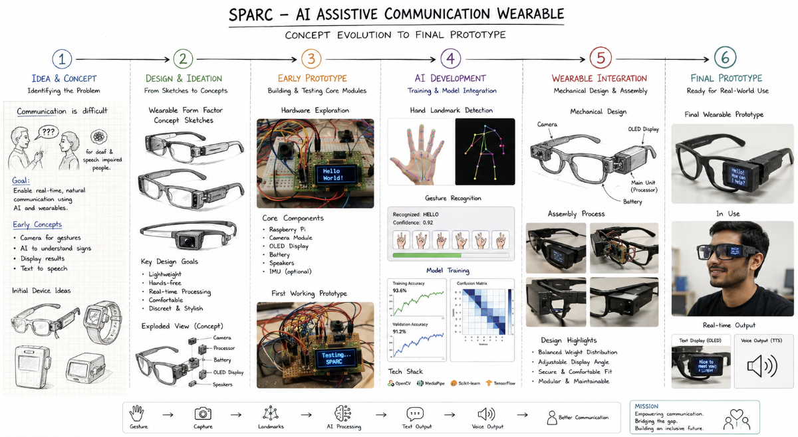

</div>
