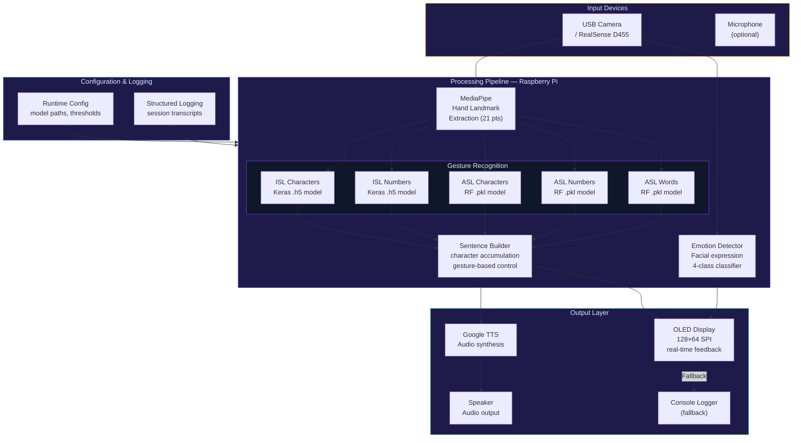

<div align="center">

# SPARC — Smart Perception Assistive Reality Companion

**On-device sign language recognition (ISL + ASL) with emotion detection, text-to-speech, and OLED HUD — entirely edge-deployed on Raspberry Pi with zero cloud dependency**


</div>

---

## The Problem

Over 70 million people globally use sign language as their primary communication method, yet most environments lack interpreters or real-time translation tools. The hearing impaired face a persistent communication barrier in everyday interactions — ordering food, speaking to healthcare providers, navigating public services — where the other party doesn't understand sign language.

Existing solutions are cloud-dependent (latency, privacy concerns, internet requirement) or support only ASL. There's no affordable, portable, on-device system that supports both Indian Sign Language (ISL) and American Sign Language (ASL) simultaneously.

SPARC is a fully self-contained hardware companion that runs all inference on-device, supports dual language recognition, provides audio output via text-to-speech, and displays feedback on a micro-OLED HUD — with graceful degradation when optional peripherals are disconnected.

---

## What This Does

A retrofittable assistive wearable module that recognizes sign language gestures in real-time and converts them to spoken words — entirely on-edge hardware.

- **ISL + ASL dual support** — characters, numbers, and common words across both languages
- **Real-time inference** — hand landmark extraction via MediaPipe → classification via Keras/TensorFlow (.h5) and scikit-learn Random Forest (.pkl)
- **Emotion detection** — facial expression analysis across four affective states (Angry, Happy, Neutral, Sad)
- **Sentence builder** — accumulates recognized characters with gesture-based backspace and completion triggers
- **Text-to-speech** — Google TTS audio synthesis of constructed sentences
- **OLED HUD** — 128×64 SPI display for real-time visual feedback without a monitor
- **Graceful hardware fallback** — automatic degradation when OLED or RealSense camera is unavailable

---

## System Architecture



---

## Tech Stack

| Component | Technology | Role |
|:---|:---|:---|
| **Hand Tracking** | MediaPipe Hands | 21-point hand landmark extraction per frame |
| **ISL Models** | TensorFlow / Keras (.h5) | CNN-based character and number classification |
| **ASL Models** | scikit-learn Random Forest (.pkl) | Lightweight classification for characters, numbers, words |
| **Emotion Detection** | Custom CNN / OpenCV | Facial expression analysis (4 classes) |
| **Text-to-Speech** | Google TTS (gTTS) | Audio synthesis of recognized words and sentences |
| **Display** | SSD1306 OLED (128×64, SPI) | Wearable HUD for real-time visual feedback |
| **Depth Camera** | Intel RealSense D455 (optional) | Depth-aware gesture capture via pyrealsense2 |
| **Platform** | Raspberry Pi 4 / 5 | Edge compute — no cloud, no internet required |
| **Language** | Python 3.9+ | All application logic |

---

## Supported Recognition Modes

| Mode | Language | Input Source | Output | Model Format | Accuracy |
|:---|:---|:---|:---|:---|:---|
| ISL Characters | Indian Sign Language | Hand landmarks | Text / TTS | `.h5` (Keras) | ~92% |
| ISL Numbers | Indian Sign Language | Hand landmarks | Text / TTS | `.h5` (Keras) | ~95% |
| ASL Characters (A–Z) | American Sign Language | Hand landmarks | Text / TTS | `.pkl` (RF) | ~89% |
| ASL Numbers (1–9) | American Sign Language | Hand landmarks | Text / TTS | `.pkl` (RF) | ~94% |
| ASL Common Words | American Sign Language | Hand landmarks | Text / TTS | `.pkl` (RF) | ~87% |
| Emotion | — | Face detection | Display / Log | `.h5` (CNN) | ~85% |

---

## Design Principles

**Graceful hardware degradation** — SPARC is designed to operate on the minimum available hardware. If the OLED display is disconnected, all feedback routes to console logging. If the RealSense camera is absent, the system falls back to a standard USB webcam. No peripheral failure halts execution.

**Strict modularity** — every recognition module, output handler, and configuration loader is a standalone file under 300 lines. This ensures isolated testing, clear interfaces, and straightforward extension for new sign languages.

**Zero cloud dependency** — all inference runs locally on the Raspberry Pi. No API keys, no internet connection, no data leaves the device. This is critical for privacy in healthcare and educational deployments.

---

## Getting Started

### Prerequisites
- Raspberry Pi 4/5 (4GB+ RAM recommended)
- USB webcam (or Intel RealSense D455)
- Python 3.9+
- Optional: SSD1306 OLED display (128×64, SPI)

### Installation

```bash
# Clone the repository
git clone https://github.com/Hazz-Y/SPARC-Smart-Perception-Assistive-Reality-Companion.git
cd SPARC-Smart-Perception-Assistive-Reality-Companion

# Install dependencies
pip install -r requirements.txt

# Run the main application
python main.py --mode isl_characters

# Available modes: isl_characters, isl_numbers, asl_characters, asl_numbers, asl_words, emotion
```

### Configuration

Edit `config.yaml` to set model paths, confidence thresholds, camera source, and OLED parameters.

---

## Project Structure

```
SPARC-Smart-Perception-Assistive-Reality-Companion/
├── models/
│   ├── isl_characters.h5        # Keras ISL character model
│   ├── isl_numbers.h5           # Keras ISL number model
│   ├── asl_characters.pkl       # RF ASL character model
│   ├── asl_numbers.pkl          # RF ASL number model
│   ├── asl_words.pkl            # RF ASL word model
│   └── emotion_model.h5         # CNN emotion classifier
├── recognizers/
│   ├── isl_recognizer.py        # ISL inference pipeline
│   ├── asl_recognizer.py        # ASL inference pipeline
│   └── emotion_detector.py      # Facial expression analyzer
├── output/
│   ├── tts_engine.py            # Google TTS integration
│   ├── oled_display.py          # SSD1306 OLED driver
│   └── sentence_builder.py      # Character accumulation logic
├── utils/
│   ├── camera.py                # Camera abstraction (USB / RealSense)
│   ├── config.py                # Configuration loader
│   └── logger.py                # Structured session logging
├── config.yaml
├── main.py
├── requirements.txt
└── README.md
```

---

## License

MIT — see [LICENSE](LICENSE) for details.
